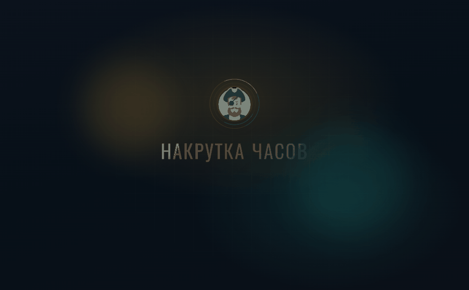
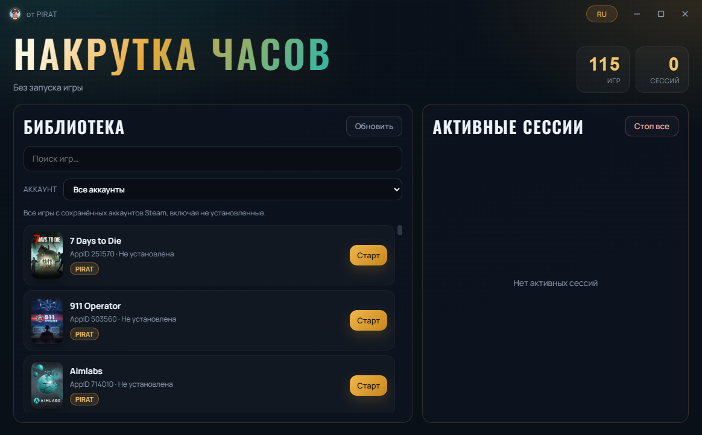

# 🏴‍☠️ PIRAT — Накрутка часов Steam

> Красивая Windows‑утилита для idle / hour boost **без запуска игры**.  
> Создано **PIRAT**.

[](#-требования)
[](#-сборка-из-исходников)
[](https://github.com/kochilorov5-lab/PIRAT/releases)
[](https://github.com/kochilorov5-lab/PIRAT/releases)

<p align="center">
  
</p>

<p align="center">
  
  &nbsp;
  
</p>

<p align="center"><sub>🎬 Splash → главное окно · реальные скриншоты утилиты</sub></p>

---

## ✨ Возможности

- 🎮 **Idle без запуска игры** — Steam видит активность через Steamworks API  
- 📚 **Полная библиотека** — установленные и не установленные игры  
- 👥 **Мульти‑аккаунт** — теги владельцев и фильтр, если на ПК несколько Steam‑аккаунтов  
- ⚡ **Несколько сессий сразу** — крути часы на нескольких играх параллельно  
- 🖼️ **Обложки игр** — локальный кэш Steam + CDN  
- 🚀 **Запуск Steam из утилиты**, если клиент выключен  
- 🌈 **Красивый UI** — splash, hover‑эффекты, достижения, RU / EN  
- 🪟 **Frameless окно** — кастомный title bar и ресайз  

---

## 📥 Скачать

Готовые сборки лежат в **[Releases](https://github.com/kochilorov5-lab/PIRAT/releases)**:

| Формат | Файл |
|--------|------|
| 📦 ZIP | `PIRAT-Windows.zip` |
| 🗜️ RAR | `PIRAT-Windows.rar` |

1. Скачай архив  
2. Распакуй  
3. Запусти `PIRAT.exe`  
4. Включи Steam и выбери игру  

> 💡 Первый запуск может запросить доступ к сети (обложки / метаданные Store).

---

## 🖥️ Требования

- Windows 10 / 11 (x64)  
- Установленный **Steam**  
- Microsoft **Edge WebView2** (обычно уже есть в Windows 10/11)  
- Для idle нужен запущенный клиент Steam  

---

## 🚀 Быстрый старт (готовая сборка)

```text
PIRAT.exe
```

Или через ярлык:

```bat
Start PIRAT.bat
```

---

## 🛠️ Сборка из исходников

```bat
py -3 -m pip install -r requirements.txt
py -3 main.py
```

Сборка EXE:

```bat
build_exe.bat
```

Готовый файл: `dist\PIRAT.exe`

---

## 📁 Структура

```text
PIRAT/
├── main.py              # Точка входа
├── pirat/               # Логика Steam / idle / UI API
├── web/                 # Интерфейс (HTML / CSS / JS)
├── vendor/              # steam_api64.dll
├── assets/              # Иконки
├── PIRAT.spec           # PyInstaller
└── build_exe.bat
```

---

## ⚠️ Важно

- Утилита предназначена для личного использования.  
- Idle / hour boost может нарушать правила Steam — используй на свой риск.  
- Не передавай свой `steam_api64.dll` из чужих игр, если не уверен в источнике: в репозитории лежит бандл для сборки.  

---

## 🤝 Автор

Сделано с ⚓ и янтарем для ночных накруток.

**PIRAT** · [GitHub](https://github.com/kochilorov5-lab)

---

## 📜 Лицензия

Исходники в этом репозитории можно использовать и изменять для личных нужд.  
Название и бренд **PIRAT** сохраняй, если публикуешь форк публично.
